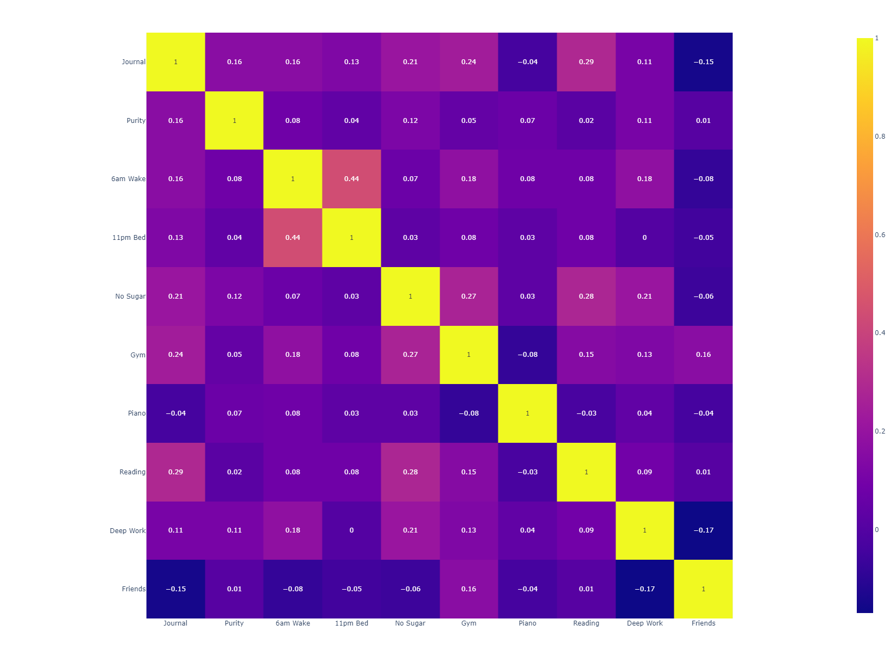
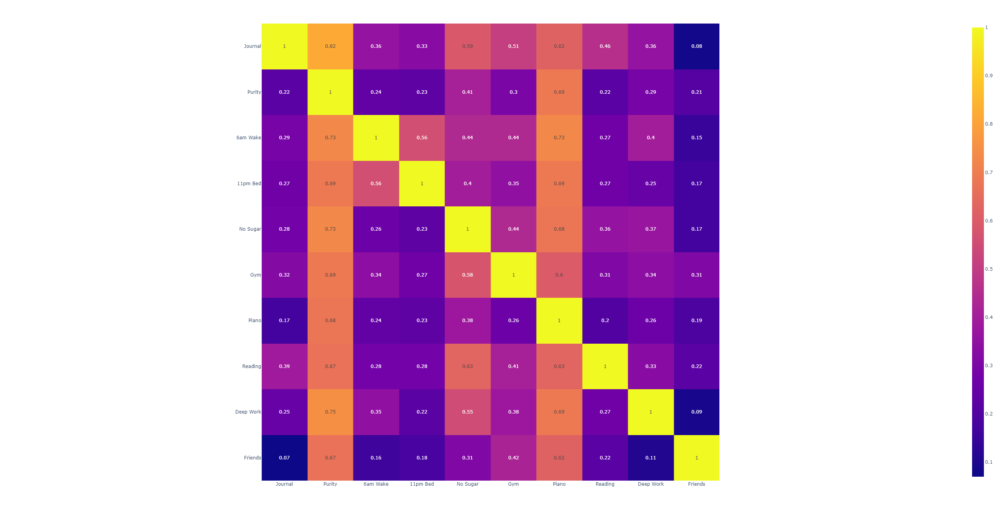

# Life Analysis
Used a digital wellbeing mobile app called Well Log. Tracked various personal lifestyle features to motivate myself to improve my habits. Produced the cross-correlation matrix and conditional-probability distribution between features to try and chain habits for a more productive day. 

Based on the Gantt chart and cross-correlation matrix, it was seen that 4 variables were redundant i.e. they are constant with respect to time. Hence they could be eliminated from the dataset. This allowed for dimensionality reduction in the final plot.

## Gantt Chart for Lifestyle Habits

## Cross-correlation Matrix

## Conditional Probability Disitribution

