# Life in Data

## Introduction
I used a digital well-being mobile app. Tracked various lifestyle features to motivate me to improve my habits and used feature engineering through the Shannon-Entropy theory to chain habits for a more productive day. It was seen that 4 variables were redundant i.e. they are constant with respect to time. Hence they could be eliminated from the dataset. This allowed for dimensionality reduction.

## Productivity Analysis
### Gantt Chart for Lifestyle Habits
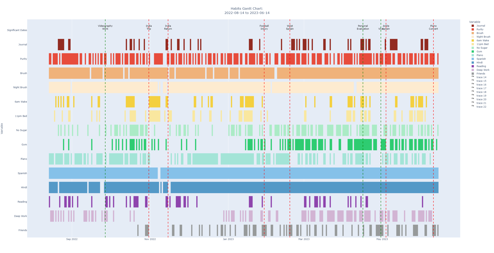

### Average 'Success-rate' Bar Chart (and sorted)
<table>
  <tr>
    <td>
      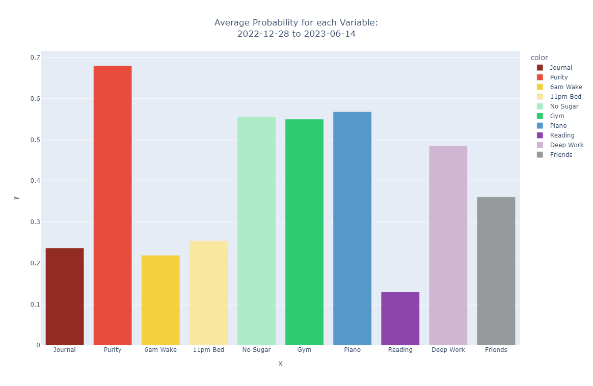
    </td>
    <td>
      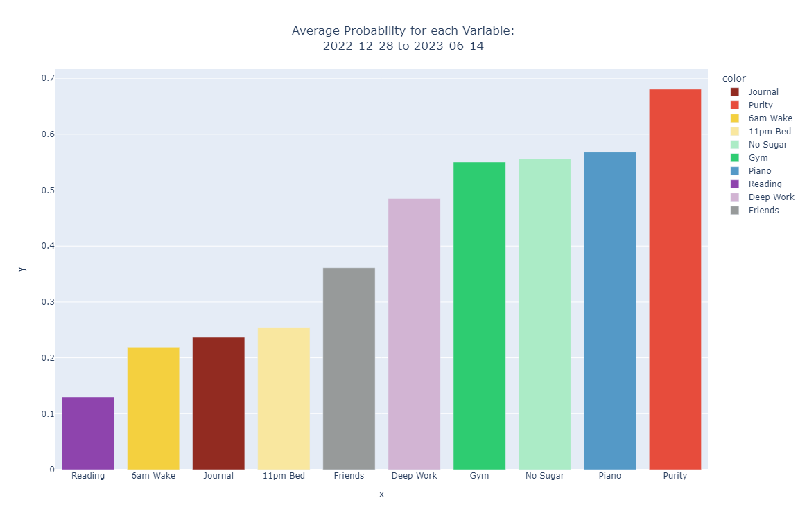
    </td>
  </tr>
</table>

### Average 'Success-rate' Binned by Hours
<table>
  <tr>
    <td>
      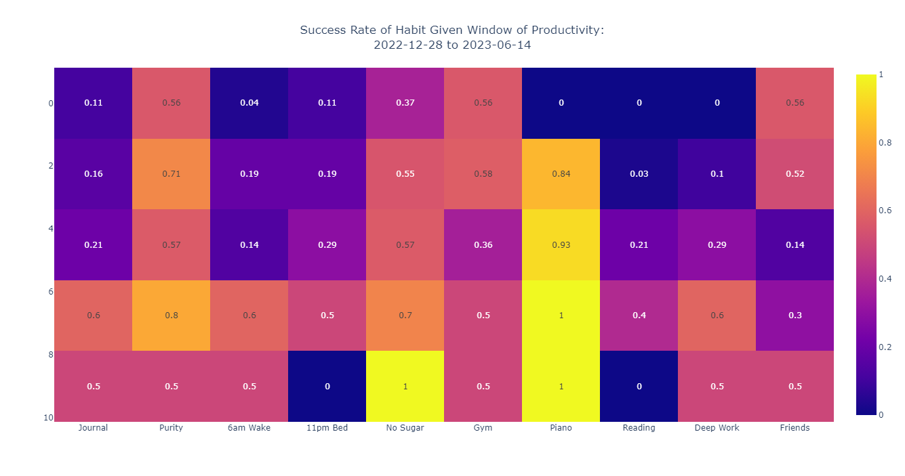
    </td>
    <td>
      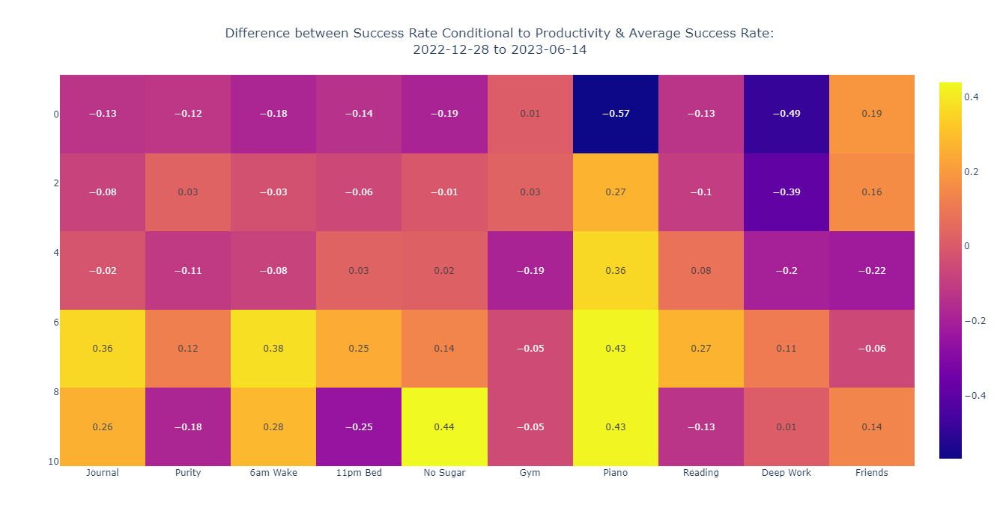
    </td>
  </tr>
</table>

### Daily Productivity Bar Charts 
<table>
  <tr>
    <td>
      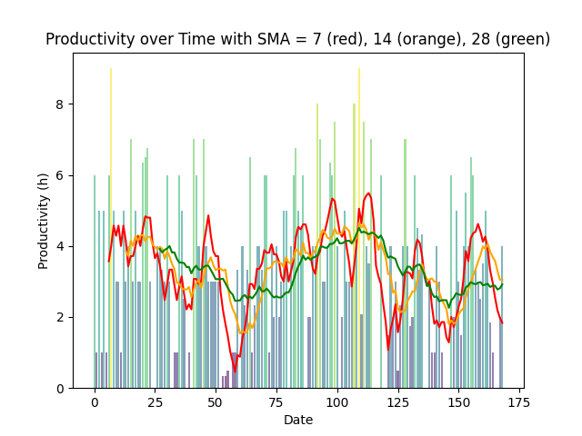
    </td>
    <td>
      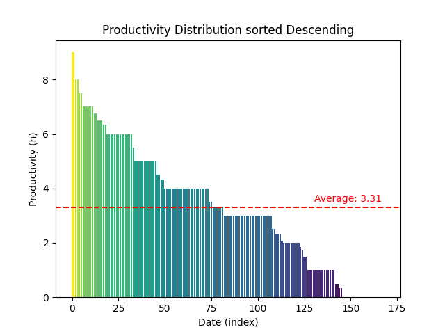
    </td>
  </tr>
</table>

### Daily Productivity Frequency Density Plots
<table>
  <tr>
    <td>
      
    </td>
    <td>
      
    </td>
  </tr>
</table>

## Statistical Dependence Analysis
### Joint Probability Distributions
<table>
  <tr>
    <td>
      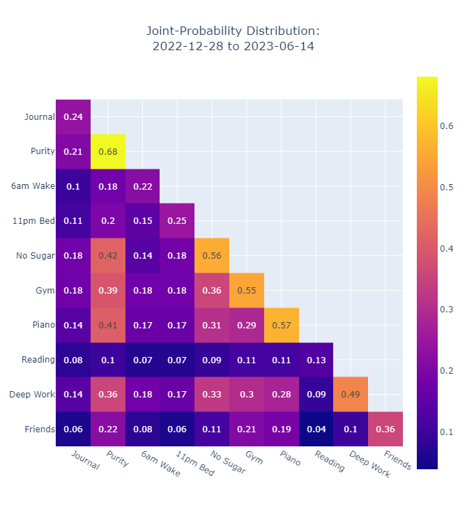
    </td>
    <td>
      
    </td>
  </tr>
</table>

### Cross-correlation Matrix

### Dissimilarity Map between ML-maxed Cross-Correlation & Conditional Probability Distribution
<table>
  <tr>
    <td>
      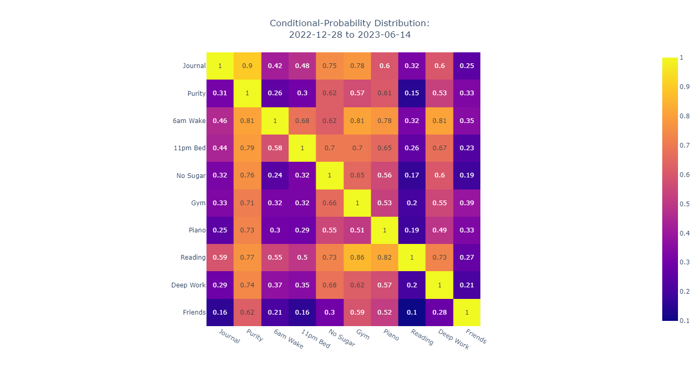
    </td>
    <td>
      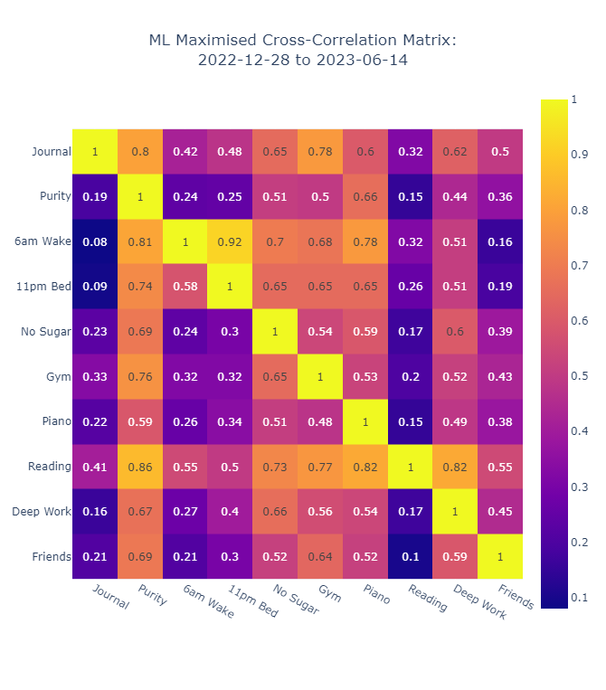
    </td>
    <td>
      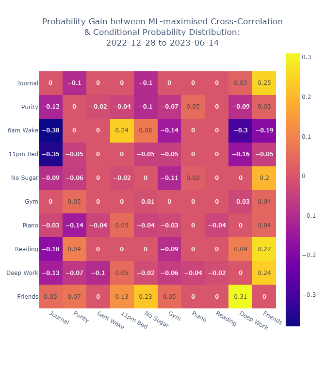
    </td>
  </tr>
</table>

### Joint-Probability-based Variable Dependence
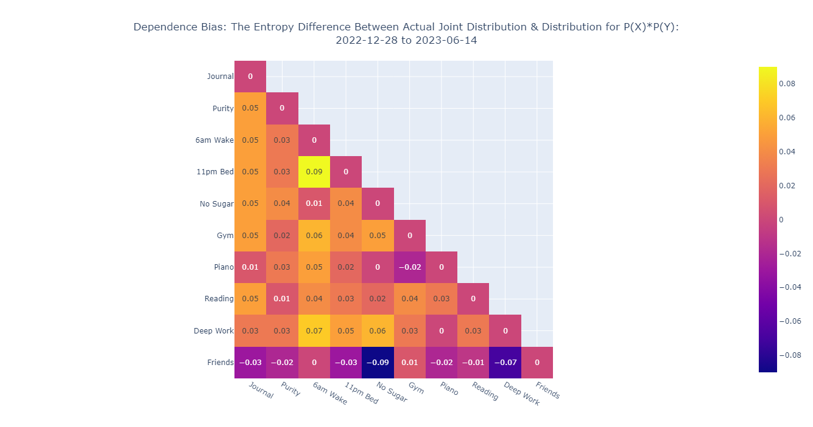

### Shannon-Entropy-based Feature Significance
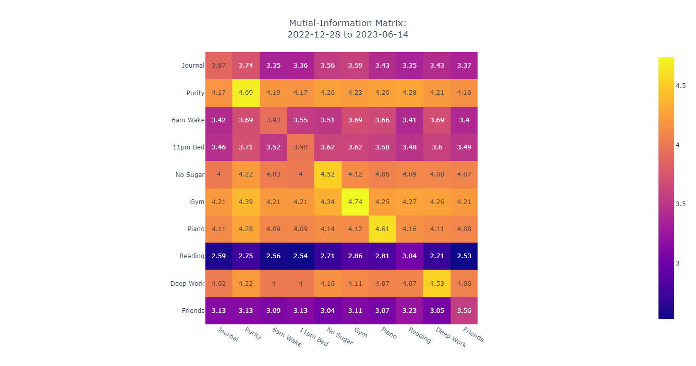

