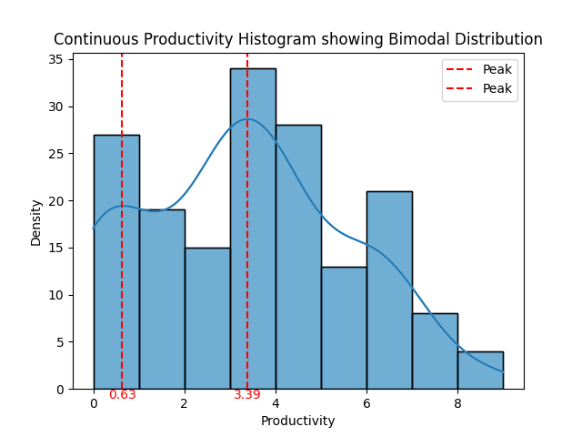

# Life in Data

## Summary
Used a well-being mobile app & feature engineering to chain habits for a more productive day. It was seen that 4 variables were redundant i.e. they are constant w.r.t. time. Hence they could be eliminated from the dataset, allowing for dimensionality reduction. Notably, sugar consumption was linked with socials. It is hypothesised there is a difference in mentality between a 'relaxed day' and a 'productive day' as the productivity histograms clearly show at least a bimodal distribution. Moreover, there is an 80% increase in productivity hours between the combination of (no-sugar + no-social) and (sugar + social) days.

Otherwise, the strongest correlation between any variables is between bedtimes: the ML algorithm successfully predicts that a 6 a.m. wake-up is preceded by an 11 p.m. bedtime the day before. A 6 a.m. wake-up has the greatest effect on the expected productivity. Hence, simply ensuring these 4 variables are achieved can boost one's output. However, a certain level of socialising is necessary for well-being. One can be mindful of their diet & exercise to offset the nonchalant approach that is taken when going out.

## Method
### Gantt Chart for Lifestyle Habits

  
## Results
### Average 'Success-rate' Bar Charts
<table>
  <tr>
    <td>
      
    </td>
    <td>
      
    </td>
  </tr>
</table>

### Average 'Success-rate' Binned by Hours
<table>
  <tr>
    <td>
      
    </td>
    <td>
      
    </td>
  </tr>
</table>

### Conditional Expectation Distributions
<table>
  <tr>
    <td>
      
    </td>
    <td>
      
    </td>
  </tr>
</table>

### Mutually Exclusive Truth Tests
<table>
  <tr>
    <td>
      
    </td>
    <td>
      
    </td>
  </tr>
</table>

  
## Productivity Analysis
### Daily Productivity Bar Charts 
<table>
  <tr>
    <td>
      
    </td>
    <td>
      
    </td>
  </tr>
</table>

### Daily Productivity Frequency Density Plots
<table>
  <tr>
    <td>
      
    </td>
    <td>
      
    </td>
  </tr>
</table>

  
## Statistical Dependence Analysis
### Cross-correlation Matrix

### Shannon-Entropy Dissimilarity Map for Joint Probability Distribution
<table>
  <tr>
    <td>
      
    </td>
    <td>
      
    </td>
    <td>
      
    </td>
  </tr>
</table>

### Dissimilarity Map between ML-maxed Cross-Correlation & Conditional Probability Distribution
<table>
  <tr>
    <td>
      
    </td>
    <td>
      
    </td>
    <td>
      
    </td>
  </tr>
</table>

  
## Feature Significance Analysis
### Conditional Entropy & Information Flow
<table>
  <tr>
    <td>
      
    </td>
    <td>
      
    </td>
  </tr>
</table>

### Mutual Information Matrix

  
## Causal-Delta Predictions
### Thresholding ML-maximised Cross-correlation > 0.7
<table>
  <tr>
    <td>
      
    </td>
    <td>
      
    </td>
  </tr>
</table>

### Thresholding Dissimilarity > 0.2
<table>
  <tr>
    <td>
      
    </td>
    <td>
      
    </td>
  </tr>
</table>

  
## References

Cover, Thomas M.; Thomas, Joy A. (2005). Elements of information theory (PDF). John Wiley & Sons, Ltd. pp. 13–55. ISBN 9780471748823.

