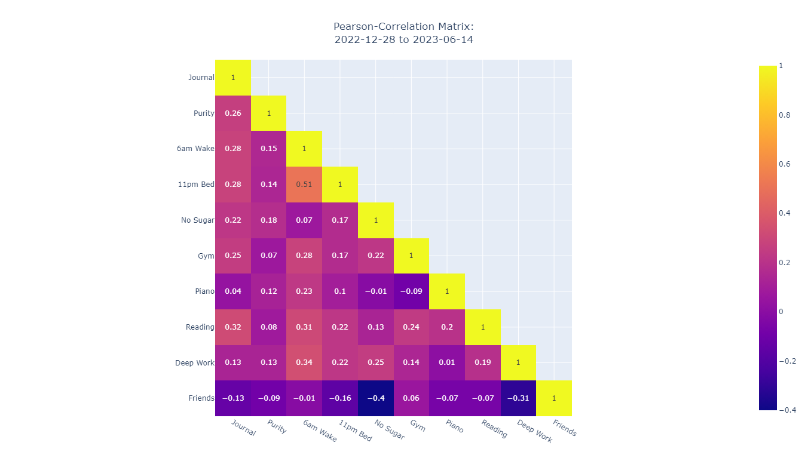

# Life Analysis
I used a digital well-being mobile app. Tracked various lifestyle features to motivate me to improve my habits and used feature engineering through the Shannon-Entropy theory to chain habits for a more productive day. It was seen that 4 variables were redundant i.e. they are constant with respect to time. Hence they could be eliminated from the dataset. This allowed for dimensionality reduction.

## Gantt Chart for Lifestyle Habits

## Productivity over Time

## Productivity Distribution Sorted

## Productivity Frequency Distribution

## Cross-correlation Matrix

## Conditional Probability Disitribution

## ML-maximised Distribution

## Joint-Probability-based Variable Dependence

## Shannon-Entropy-based Feature Significance

